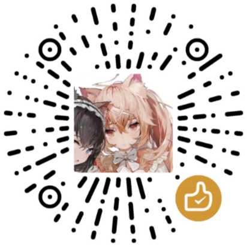

# Dungeon-Lab HTTP客户端 (蛋糕实验室)
使用HTTP服务控制您的MP3
> 项目开发不易 如果可能的话请支持该项目 (QQ: 401395069)
> 
> 此外 如果您需要使用这个项目进行商业活动 请参考官方API文档的[联系我们](https://www.dungeon-lab.com)一栏

## 如何运行
下载预编译的二进制 (大概也许只提供Windows的 如果有好心人愿意开PR帮我配置Github Actions也可以)

运行: `./dglab-http [你的MP3的蓝牙地址]`

## 如何编译
```shell
git clone https://github.com/tinygo-org/bluetooth
cd bluetooth
git clone https://github.com/Rabbit0w0/dglab-http
go build ./dglab-http
```

## HTTP API
### `/status` - ANY
获得当前设备信息

响应
- `battery` 电量 (int [0, 100])
- `chanAPower` A输出强度 (int [0, 2047])
- `chanBPower` B输出强度 (int [0, 2047])

### `/setPower` - POST
设置输出强度

请求
- `powerA` A输出强度 (int [0, 2047])
- `powerB` B输出强度 (int [0, 2047])
- 注: 这里的强度应该是APP内显示强度乘以7

响应
- `message` 信息

### `/sendWave` - POST
发送波形数据

请求
- `channel` 输出频道 1为A 2为B (int [0, 1])
- `paramX` X数据 (int [0, 31])
- `paramY` Y数据 (int [0, 1023])
- `paramZ` Z数据 (int [0, 31])

响应
- `message` 信息

```go
type SetPowerRequest struct {
	PowerA uint `json:"powerA" binding:"required,min=0,max=2047"`
	PowerB uint `json:"powerB" binding:"required,min=0,max=2047"`
}

type SendWaveRequest struct {
	Channel uint `json:"channel" binding:"required,min=1,max=2"`
	ParamX  uint `json:"paramX" binding:"required,min=0,max=31"`
	ParamY  uint `json:"paramY" binding:"required,min=0,max=1023"`
	ParamZ  uint `json:"paramZ" binding:"required,min=0,max=31"`
}
```

---
请我喝杯咖啡

